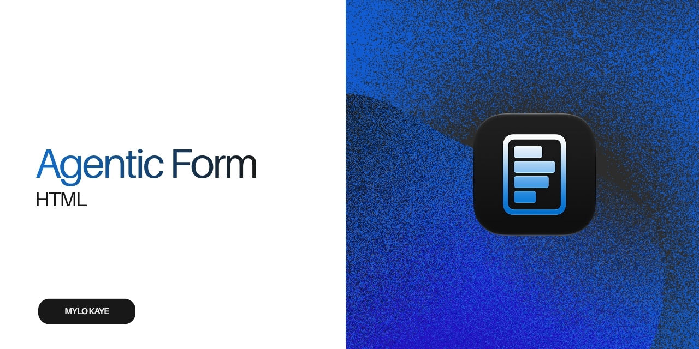

#  Agentic Form

A portable, two-step inquiry form built with plain HTML, CSS, and JavaScript. The browser UI lives in `index.html`; the Sites worker serves the static form.

## Files

- `index.html` — form UI, styles, browser logic, Google Fonts Inter stylesheet link, site-wide GA4 tag (`G-0K36MBFB25`), and GA4 lifecycle events.
- `assets/` — supplied README banner, original blue form icon, browser favicons, Apple touch icon, and web app icons; all site icons are included in the Sites package.
- `site.webmanifest` — site identity and home-screen icon metadata.
- `dev-proxy.mjs` — serves the local preview and its same-origin TypeSafe route.
- `scripts/build-site.mjs` — packages the form and TypeSafe route for Sites.
- `tests/form-flow.spec.mjs` — Playwright regression tests.
- `AGENTS.md` — implementation standards.
- `DESIGN.md` — visual and responsive design direction.

## Site icons

The supplied 1024px icon is the source for 16px, 32px, 48px, and 96px PNG favicons, a 16/32/48px ICO fallback at `/favicon.ico`, and an opaque 180px Apple touch icon at `/apple-touch-icon.png`. The manifest lists 192px, 512px, and the original 1024px icons, plus a separate opaque, padded 512px maskable icon for adaptive home-screen shapes. The manifest keeps the normal browser display mode; it adds no offline support or service worker.

Both the local preview and the Sites worker serve the icons and manifest with their appropriate content types.

## Form flow

1. **Inquiry** — First name, last name, email, inquiry, business, and inquiry type. Inquiry type is an editable text field prefilled with `Aftermarket`; there is no inquiry subtype. When Continue is clicked, non-empty Inquiry text is sent to TypeSafe, which suggests New Business, Service, Parts, or Other. The suggestion replaces the default unless the visitor has edited Inquiry type. The three personal fields have configured defaults. Continue also derives company details from the email domain.
2. **Personal details and submit** — Phone, role, language, company name, industry, country, State, the privacy note, and Submit Inquiry. Country sits beside Industry on wider screens and its list is alphabetised; State appears directly below it only when United States is selected and is disabled otherwise, so it is excluded from form submissions. Defaults include Manager, Aerospace, and Alabama; Country starts empty. Language is prefilled from the browser locale when recognised, and F1 can prefill Country and an international Phone prefix from the visitor's approximate IP country. Back returns to Step 1; Submit Inquiry opens the post-submit feedback screen.

After submission, the prototype shows an inquiry thank-you screen with five clickable stars and no progress bar. Clicking any star changes the screen to `Thank you for your feedback.` without sending or storing the rating.

The Step 1 disclosure says that Inquiry text is sent to TypeSafe for an inquiry-type suggestion. The Step 2 GDPR consent note uses 12px text at every viewport width and reads: `Personal information is processed in accordance with GDPR & our Privacy Policy.` The Privacy Policy is currently plain text because no destination URL is configured.

The standalone **Debug** panel appears below the progress bar only when the URL includes `?debug`. It includes a read-only `currentUrl` field. F9 sets it to the full URL of the page that loaded the form, including any query string or hash. The current prototype does not transmit it.

Stage changes use brief entry motion and a progress-bar width transition. The action row remains still. The feedback thank-you message also enters smoothly. These effects are disabled when the browser requests reduced motion.

## Validation and privacy

- First name, last name, and email are required before leaving Stage 1.
- A failed required-field validation uses a red edge on the affected field, which clears once it is corrected. The form does not show a shared status banner.
- Returning from Stage 2 places keyboard focus on First name, the first field in Stage 1.
- Email-domain suggestions fill only empty Website and Company name fields. Website suggestions use an `https://` URL; untouched suggestions refresh when Email changes, manual edits remain unchanged, and personal names are not inferred.
- Company enrichment and newsletter subscription have been removed. Website URLs are not sent to an AI provider. F15 sends only non-empty Inquiry text to TypeSafe to suggest a category; it does not send names, email, or other form fields. The server key and classification text are not logged or stored by this prototype.
- F15 uses TypeSafe's Choice result without a confidence threshold. If classification fails, Continue still advances and Inquiry type remains unchanged; the visitor sees a status explaining this and can edit the type after returning to Step 1.
- **F1 country lookup** makes one best-effort browser request to FreeIPAPI when the form loads. It uses a recognised ISO country code to prefill Country and the first valid international dialling code to prefill an empty Phone number. It leaves both fields empty on failure and never overwrites a visitor's entered Country or Phone number.
- F1 writes generic `[F1]` technical status messages to the browser console. Those messages never include an IP address, country, form value, or submission data.
- Language uses the browser's local `navigator.language` preference, converting its base locale to an English language name (for example, `de-DE` becomes German). It makes no network request and remains editable.
- Submit Inquiry on Step 2 is a local prototype action only. It opens the post-submit feedback screen and emits a generic technical console message; no form data is sent to a submission backend.
- **F14 analytics** sends `form_view`, `form_start`, `form_step_view`, `form_step_complete`, `form_validation_error`, `form_submit`, `form_submit_success`, and `form_submit_error` to GA4. Events include only the fixed form name and numeric/static step metadata; they never include form fields, URLs, or feedback ratings.
- **F13 feedback rating** displays five keyboard-accessible clickable star buttons after submission. Clicking any star reveals the feedback thank-you message; the rating is not recorded, stored, or transmitted.
- **F9 debug-gated current URL capture** records the page URL in the read-only `currentUrl` field on load. The standalone Debug panel is visible only with `?debug`; F9 does not log, store, or send the value.
- **F15 TypeSafe classification** maps the primary intent in Inquiry to New Business, Service, Parts, or Other. TypeSafe's top Choice is used without a confidence threshold; the browser receives only the allowlisted label, and a visitor-edited Inquiry type is preserved.

## Known limitations

- F1 location and dialling-prefix suggestions are approximate, depend on FreeIPAPI availability, and can be affected by VPNs, mobile networks, or shared connections.
- Browser language is a device preference, not a confirmed language preference; visitors can edit the suggested value.
- The post-submit star rating is a visual prototype only and is not connected to a survey, CRM, analytics event, or submission service.

## Run locally

Add `TYPESAFE_API_KEY=...` to the ignored `.env.local` file, then start the local form and classification server:

```sh
npm run dev
```

The local preview runs at `http://localhost:8001`. Without a key, the form still advances when classification is unavailable and keeps the current Inquiry type. Hosted deployments also need `TYPESAFE_API_KEY` configured as a server-side worker secret; never add it to `index.html`.

## Test

```sh
npm install
PORT=8000 npm run dev
npm run test:e2e
```

Test the hosted form:

```sh
BASE_URL="https://forms-v2-mylo.v6pdwnhvws.chatgpt.site" npm run test:e2e
```

Run the optional Playwright suite with `npm run test:e2e`.

## Privacy and support

- Google Analytics 4 is loaded site-wide with measurement ID `G-0K36MBFB25` for the form lifecycle events described above. Analytics requests contain only fixed event names and non-personal step metadata; analytics does not receive names, email addresses, messages, URLs, or ratings.
- The form does not use other analytics, first-party tracking pixels, localStorage, or sessionStorage.
- Inter is loaded from Google Fonts for typography; loading the form makes requests to Google font domains, which are subject to Google's privacy terms.
- The read-only Current URL value may include query-string or hash content. Do not place personal or sensitive information in form URLs.
- F1 makes a direct request to FreeIPAPI to infer a country from the visitor's IP address. The form does not retain or log that IP address or the lookup result; FreeIPAPI is a third-party service with its own privacy policy.
- F15 sends only the Inquiry text through the server-side TypeSafe API route for category classification. The text may contain personal details if the visitor enters them; the form displays this processing before Continue. The form does not log or persist that text or the API response.
- Do not log personal data or submission payloads.
- The form supports current Chrome, Edge, Safari, Firefox, Mobile Safari, and Chrome for Android.

## Design notes

See `DESIGN.md` for the durable visual system, responsive layout rules, and
design-change discipline.

## Maintenance

Keep browser-facing HTML, CSS, and JavaScript in `index.html`. Update this README whenever fields, validation, consent, submission, or privacy behaviour changes.
